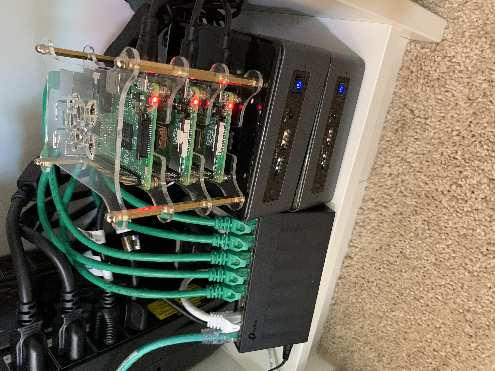
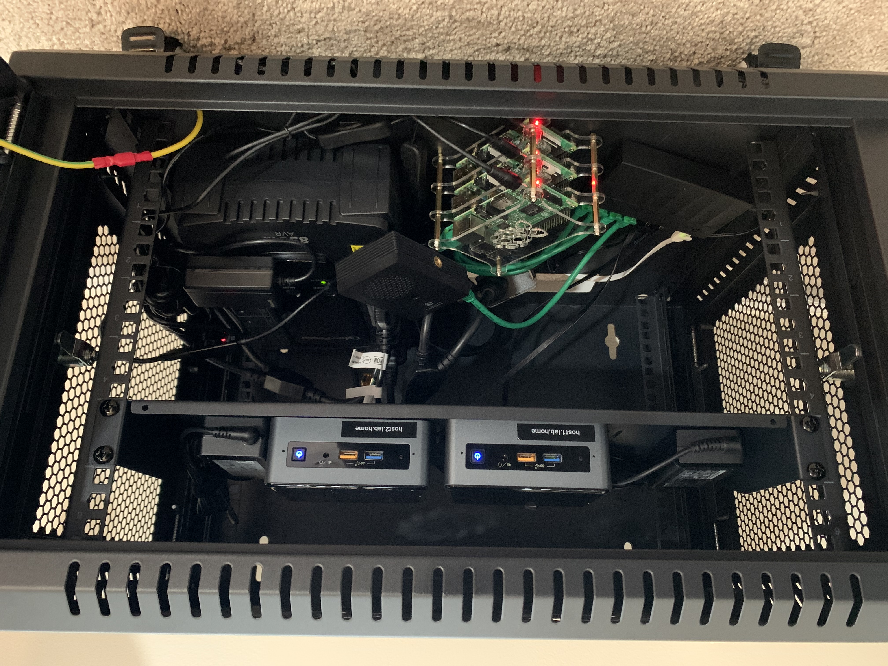

# My Home Lab


These are the playbooks I run in my personal lab.

<p align="center">
  <br>
  <b>Early setup of my lab</b><br>
</p>

## Requirements

`ssh-copy-id` to every host before running these playbooks. 

## Playbooks

### 1. Setup Lab instances

To perform some basic management tasks such as upgrading packages or updating Firewall rules:

```bash
ansible-playbook setup.yml --ask-become-pass -v
```

#### Dependencies

The role names will be according to the [requirements.yml](roles/requirements.yml) file definition.

```bash
ansible-galaxy role install -r roles/requirements.yml
```

### 2. Install Pi-hole

To install Pi-hole:

```bash
ansible-playbook pi-hole.yml --ask-become-pass -v
```

To update the list of whitelisted websites per [WHITELIST](https://github.com/anudeepND/whitelist):

```bash
ansible-playbook pi-hole.yml --ask-become-pass -v --tags whitelist
```

[Block lists](https://firebog.net/) can be added via the [GUI](https://docs.pi-hole.net/database/gravity/example/).

### 3. Cloud monitoring with Grafana Agent

Install [Grafana Cloud Agent](https://github.com/grafana/agent) in a RHEL/Debian host using [grafana_agent](https://galaxy.ansible.com/nleiva/grafana_agent)'s role.

```bash
ansible-playbook grafana-cloud.yml --ask-become-pass -v
```

### 4. Initial setup for a new machine

Creates my user (assuming I can ssh as root) and adds my SSH public key to the authorized users (instead of `ssh-copy-id`). 
Registers the system if it's RHEL.


```bash
ansible-playbook initial-setup.yml --ask-become-pass --ask-vault-pass
```

### 5. Install RH Satellite (WIP)

Installs RH Satellite 6.7 (Work in Progress) in RHEL 7.


```bash
ansible-playbook install-satellite.yml --ask-become-pass --ask-vault-pass
```

### 6. Run OpenSCAP

Perform compliance and vulnerability scanning on RHEL 8 with OpenSCAP. 
- [] TODO: Profile selection: STIG, PCI-DSS, or HIPAA


```bash
ansible-playbook openscap.yml --ask-become-pass
```

## HW details

<p align="center">
  <br>
  <b>Second iteration of my lab</b><br>
</p>


- [6U Wall Mount Rack Cabinet Enclosure](https://smile.amazon.com/gp/product/B01K1JJHTO)
- [Cantilever Server Shelf Rack Mount 19 Inch 1U](https://smile.amazon.com/gp/product/B008LUW3ZG)
- [Intel® NUC Kit NUC8i5BEH](https://www.intel.com/content/www/us/en/products/boards-kits/nuc/kits/nuc8i5beh.html)
- [Raspberry Pi 4 Model B](https://www.raspberrypi.org/products/raspberry-pi-4-model-b/)
- [Raspberry Pi 3 Model B](https://www.raspberrypi.org/products/raspberry-pi-3-model-b/)
- [Raspberry Pi Cluster Case 6-Layers](https://smile.amazon.com/gp/product/B07K72STFB)
- [5-Pack Snagless Short Cat6 Ethernet Cable](https://smile.amazon.com/gp/product/B00C2DZ85U)
- [TP-Link Litewave 8 Port Gigabit Ethernet Switch](https://smile.amazon.com/gp/product/B086384H7C)
- [CyberPower LE850G UPS Battery Backup](https://www.costco.com/cyberpower-le850g-ups-battery-backup-with-surge-protection.product.100519070.html)
